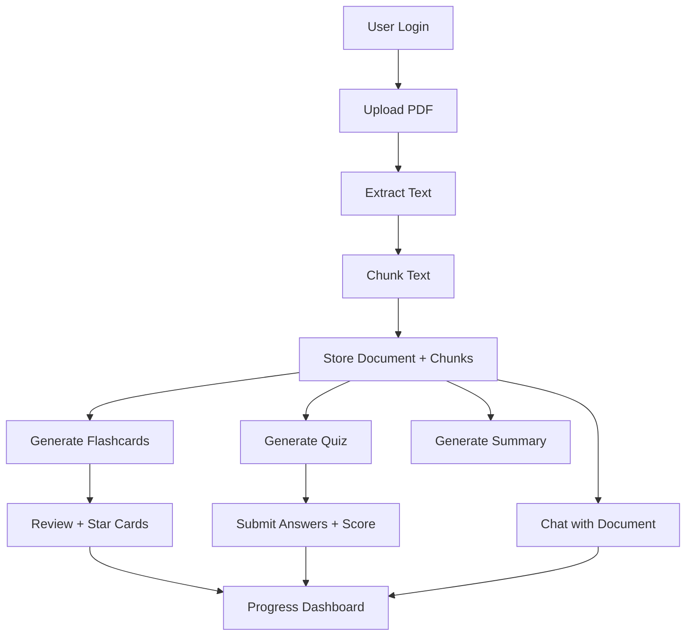

<p align="center">
	
</p>

<p align="center">
	<a href="https://cortex-lab-ten.vercel.app"></a>
	
	
	
	
	
</p>

## What Is CortexLab

CortexLab is a full-stack AI learning platform that converts PDF documents into active, test-driven study experiences. Instead of passively reading notes, learners can upload documents and instantly generate flashcards, quizzes, summaries, and contextual AI explanations.

Live frontend: https://cortex-lab-ten.vercel.app

## Table of Contents

1. Vision
2. Feature Highlights
3. Product Workflow
4. Tech Stack
5. Architecture
6. Project Structure
7. API Surface
8. Environment Variables
9. Local Setup
10. Build and Deployment
11. Security and Operations
12. Limitations and Roadmap

## Vision

CortexLab is built for students and self-learners who want to turn static study material into active recall loops:

- Learn by questioning, not just reading.
- Focus on comprehension through AI-assisted dialogue.
- Track real study activity over time.

## Feature Highlights

| Domain | Capability | Details |
| --- | --- | --- |
| Authentication | JWT-based auth and protected routes | Register, login, profile update, password change |
| Document Ingestion | PDF upload and parsing | Upload PDF, extract text, chunk for retrieval |
| AI Study Tools | Flashcards, quizzes, summaries | Gemini-backed generation from document context |
| AI Chat | Context-aware Q&A | Retrieves relevant chunks before answer generation |
| Flashcard Practice | Review and star workflow | Tracks review count, last reviewed, starred cards |
| Quiz Engine | Submission and scoring | Computes correctness and percentage with result review |
| Progress Tracking | Dashboard analytics | Learning overview + recent activity |
| Performance UX | Pagination + lazy loading | Paginated server APIs and route-level code splitting |

## Product Workflow



## Tech Stack

### Frontend (client)

- React 19
- React Router
- TanStack React Query
- Axios
- Tailwind CSS 4 + Vite
- React Markdown + remark-gfm

### Backend (server)

- Node.js + Express 5
- MongoDB + Mongoose
- @google/genai (Gemini)
- Multer (PDF upload)
- JWT + bcryptjs
- express-validator

## Architecture

### Frontend

- Single-page app with public and protected routing.
- Auth state persisted via localStorage token + user payload.
- Central Axios instance with auth header injection and 401 redirect handling.
- Route-level lazy loading for key pages.

### Backend

- Domain-based REST modules:
	- auth
	- documents
	- ai
	- flashcards
	- quizzes
	- progress
- PDF ingestion pipeline:
	1. Upload PDF (Multer)
	2. Extract text (pdf-parse)
	3. Chunk text with overlap
	4. Persist document + chunks
- AI generation layer uses gemini-2.5-flash-lite.

### Data Model Overview

- User: credentials + profile metadata.
- Document: source metadata, extracted text, chunk array, processing status.
- Flashcard: per-document card sets with review metadata.
- Quiz: generated questions, user answers, score, completion data.
- ChatHistory: per-document user/assistant transcript with relevant chunk indices.

## Project Structure

```text
CortexLab/
	client/
		src/
			components/
			context/
			pages/
			services/
			utils/
	server/
		config/
		controllers/
		middleware/
		models/
		routes/
		utils/
	README.md
```

## API Surface

Base URL (development): http://localhost:8000

### Auth

- POST /api/auth/register
- POST /api/auth/login
- GET /api/auth/profile
- PUT /api/auth/profile
- POST /api/auth/change-password

### Documents

- POST /api/documents/upload
- GET /api/documents
- GET /api/documents/:id
- DELETE /api/documents/:id

### AI

- POST /api/ai/generate-flashcards
- POST /api/ai/generate-quiz
- POST /api/ai/generate-summary
- POST /api/ai/chat
- POST /api/ai/explain-concept
- GET /api/ai/chat-history/:documentId

### Flashcards

- GET /api/flashcards
- GET /api/flashcards/:documentId
- POST /api/flashcards/:cardId/review
- PUT /api/flashcards/:cardId/star
- DELETE /api/flashcards/:id

### Quizzes

- GET /api/quizzes/:documentId
- GET /api/quizzes/quiz/:id
- POST /api/quizzes/:id/submit
- GET /api/quizzes/:id/results
- DELETE /api/quizzes/:id

### Progress

- GET /api/progress/dashboard

Note: All routes except register/login are protected and require a Bearer token.

## Environment Variables

### Server (.env in server/)

```env
PORT=8000
NODE_ENV=development
MONGODB_URI=your_mongodb_connection_string
JWT_SECRET=your_secure_random_secret
JWT_EXPIRE=7d
GEMINI_API_KEY=your_google_gemini_api_key
GEMINI_TIMEOUT_MS=45000
MAX_FILE_SIZE=41943040
MAX_CHUNKS=3000
```

### Client (.env in client/)

```env
VITE_API_BASE_URL=http://localhost:8000
```

## Local Setup

### Prerequisites

- Node.js 18+
- npm 9+
- MongoDB URI
- Gemini API key

### 1) Clone

```bash
git clone https://github.com/SKD151105/CortexLab.git
cd CortexLab
```

### 2) Start Backend

```bash
cd server
npm install
npm run dev
```

### 3) Start Frontend

```bash
cd ../client
npm install
npm run dev
```

Typical frontend dev URL: http://localhost:5173

## Build and Deployment

### Frontend Build

```bash
cd client
npm run build
```

### Backend Production Start

```bash
cd server
npm start
```

Frontend is currently deployed on Vercel.

## Security and Operations

### Security Implemented

- JWT bearer authentication
- Protected route middleware
- bcrypt password hashing
- PDF MIME-type filtering and upload size limits

### Operational Notes

- CORS is currently configured as wildcard and should be restricted in production.
- PDF processing runs in-process; a queue worker architecture is recommended for scale.
- Client stores token in localStorage.

## Limitations and Roadmap

### Current Limitations

- No automated test suite yet.
- No refresh-token or silent re-auth flow.
- Study streak currently uses placeholder logic.
- No request rate limiting or brute-force guard yet.

### Planned Improvements

- Add refresh-token based session persistence.
- Move PDF processing to a queue-backed worker.
- Introduce rate limiting and security headers.
- Add API and frontend test coverage.
- Expand progress analytics with true streak and spaced-repetition signals.

